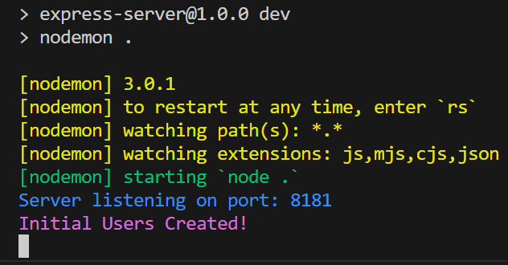
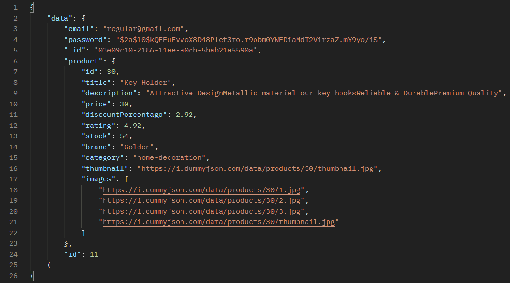

# Getting Started with node server App

This is a node.js & express server

## Installation

Download or clone the project from this repo

### Download the node_modules

Enter the following command in the cmd / terminal in the root folder of this project

```
npm i
```

### Run the typescript compiler

Run the Typescript compiler using the following command in the cmd

```
tsc -w
```

### Run the server in development mode

Open another cmd / terminal in the root folder and run the server in development mode using the following command in the cmd

```
npm run dev
```

- Runs the app with nodemon
- The page will reload if you make edits
- You should see the following text in the cmd / terminal



## Available Routes

Here you can find API addresses that the server will respond to as well as what should be sent to them in the body of the HTTP request and what permissions are required to receive a response from a specific API

### Users API

#### API for Register a new user

```http
  POST /api/users
```

#### Request

In the request body you will need to provide an object with the following keys and values

| index    | type   | min | max | remark   |
| -------- | ------ | --- | --- | -------- |
| email    | string | 5   |     | required |
| password | string | 7   | 20  | required |
|          |

- "password" must be at least nine characters long and contain an uppercase letter, a lowercase letter, a number and one of the following characters !@#$%^&\*-
- "email" must be a standard email

#### Response

Example of a response from this end point

```
{
    "email": "test@gmail.com",
    "password": "$2a$10$jhs6h3m8vqVUa2wVze7C1O98ZnKLWvTgzAzHgjsA/TjhjWDIZfHYe",
    "_id": "12ddd310-5005-11ee-98a5-6b460fe7b768"
}
```

#### API for Login a user

```http
  POST /api/users/login
```

#### Request

In the request body you will need to provide an object with the following keys and values

| index    | type   | min | max | remark   |
| -------- | ------ | --- | --- | -------- |
| email    | string | 5   |     | required |
| password | string | 7   | 20  | required |

- "email" must be a standard email
- "password" must be at least nine characters long and contain an uppercase letter, a lowercase letter, a number and one of the following characters !@#$%^&\*-

#### Response

If the user is in the database and the password sent is correct, The response will be a the following string with status code 201

```
You are logged in!
```

#### API for Information about all the users

```http
  GET /api/users
```

#### Response

The response will be an array of users

#### API for Information about a user

```http
  GET /api/users/:id
```

### Request

#### API for Updating User information

```http
  PUT /api/users/:id
```

### Request

In the request body you will need to provide an object with the following keys and values

| index    | type   | min | max | remark   |
| -------- | ------ | --- | --- | -------- |
| email    | string | 5   |     | required |
| password | string | 7   | 20  | required |
|          |

- The user "password" must be at least nine characters long and contain an uppercase letter, a lowercase letter, a number and one of the following characters !@#$%^&\*-
- "email" must be a standard email

#### API for deleting a user

```http
  DELETE /api/users/:id
```

#### API for adding a product to a user

```http
  POST /api/users/add-product/:id?product=<<productName>>
```

#### Response

Example for a response

